# Overview

This example shows how KSQL can be used to process a stream of click data, aggregate and filter it, and join to information about the users.
Visualisation of the results is provided by Grafana, on top of data streamed to Elasticsearch. 

# Documentation

You can find the documentation for running this example and its accompanying tutorial at [https://docs.confluent.io/platform/current/tutorials/examples/clickstream/docs/index.html](https://docs.confluent.io/platform/current/tutorials/examples/clickstream/docs/index.html?utm_source=github&utm_medium=demo&utm_campaign=ch.examples_type.community_content.clickstream)

# Download

You need to download datagen and elasticsearch jars

```
docker run -v $PWD/confluent-hub-components:/share/confluent-hub-components confluentinc/ksqldb-server:0.8.0 confluent-hub install --no-prompt confluentinc/kafka-connect-datagen:0.4.0
docker run -v $PWD/confluent-hub-components:/share/confluent-hub-components confluentinc/ksqldb-server:0.8.0 confluent-hub install --no-prompt confluentinc/kafka-connect-elasticsearch:10.0.2
```

# Docker compose

Then you need to build docker container 
```
docker-compose up -d
```

After it we can use this command to ensure that everything is ok

```
docker-compose ps
```

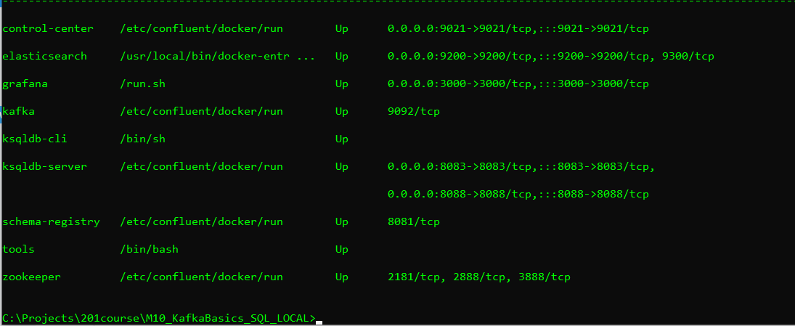

# Create clickstream data

Launch ksqlDB CLI by this command:
```
docker-compose exec ksqldb-cli ksql http://ksqldb-server:8088
```
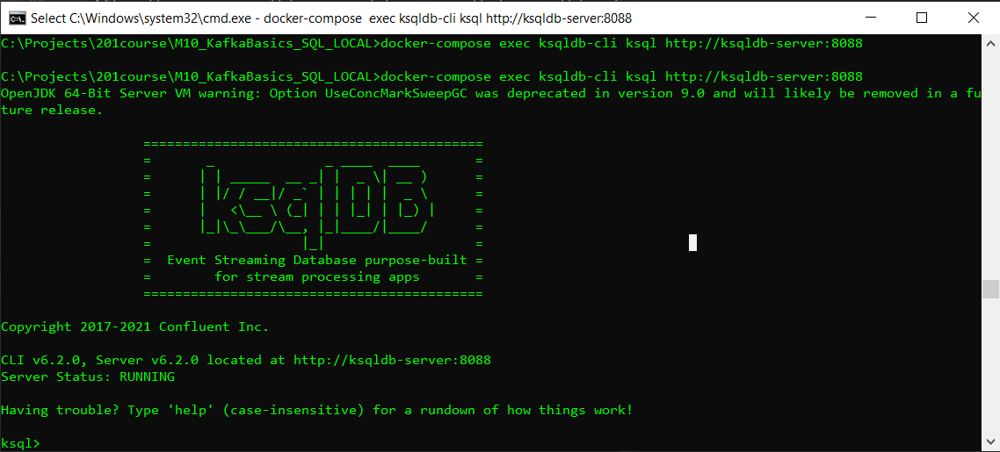

Then run this script to create three source connectors and generate mock data

```
RUN SCRIPT '/scripts/create-connectors.sql';
```
Output will be similar 

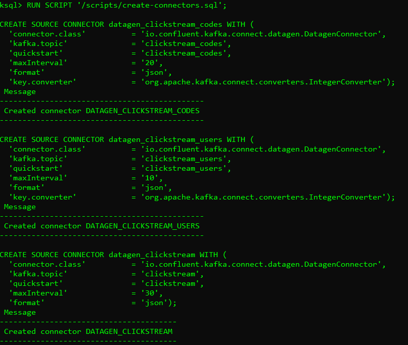

Now the clickstream generator is running, simulating the stream of clicks. Sample the messages in the clickstream topic

```
print clickstream limit 3;
```

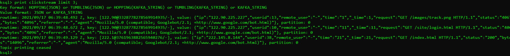

The second data generator running is for the HTTP status codes. Sample the messages in the clickstream_codes topic

```
print clickstream_codes limit 3;
```

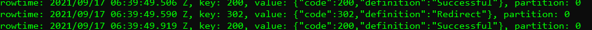

The third data generator is for the user information. Sample the messages in the clickstream_users topic

```
print clickstream_users limit 3;
```

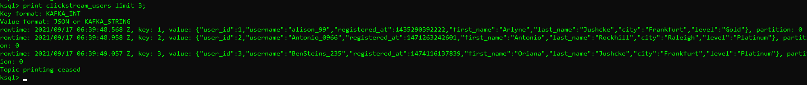

Go to Confluent Control Center UI at http://localhost:9021 and view the three kafka-connect-datagen source connectors created with the ksqlDB CLI.

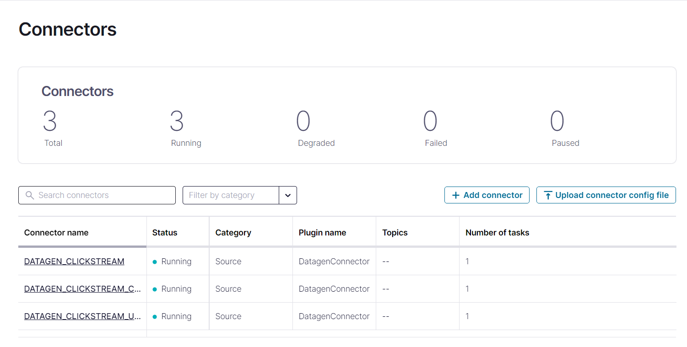

# Load the Streaming Data to ksqlDB

Load the statements.sql file that runs the tutorial app

```
RUN SCRIPT '/scripts/statements.sql';
```

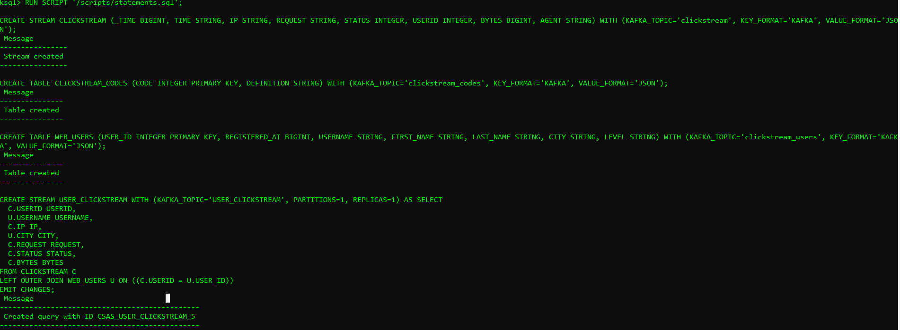

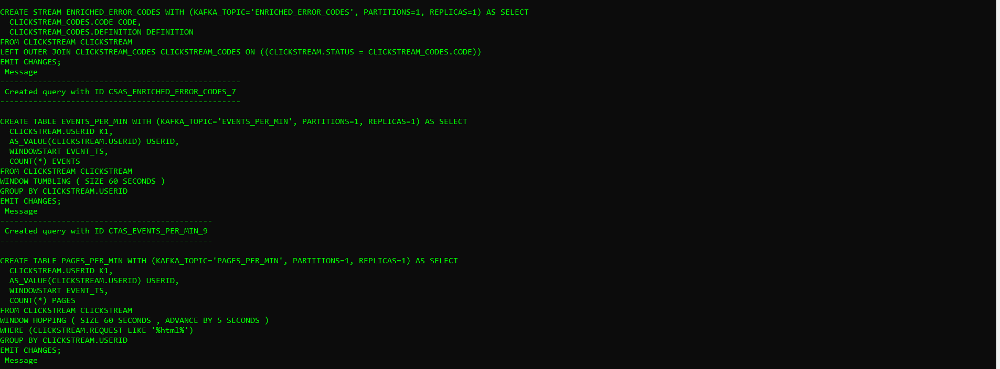

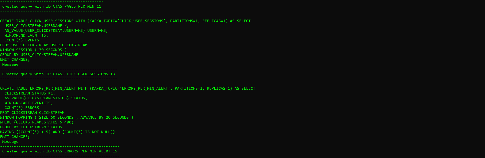

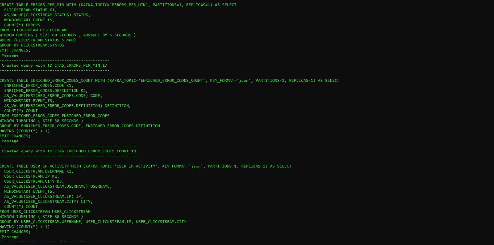

# Verify the data

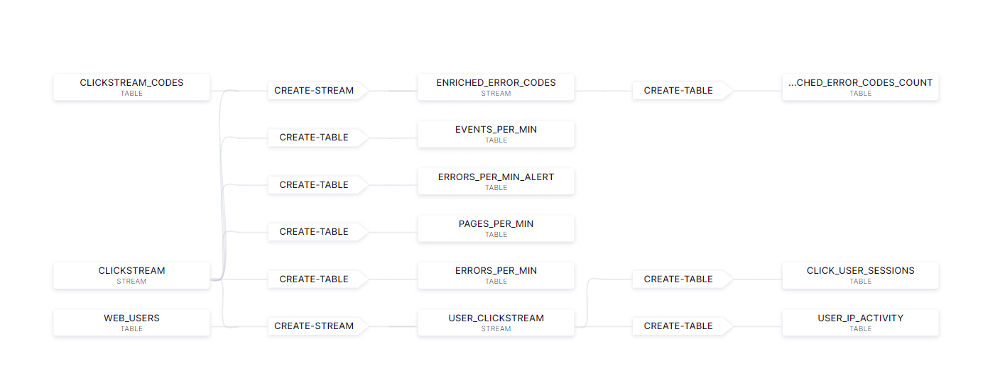

Verify that data is being streamed through various tables and streams. Query one of the streams CLICKSTREAM:

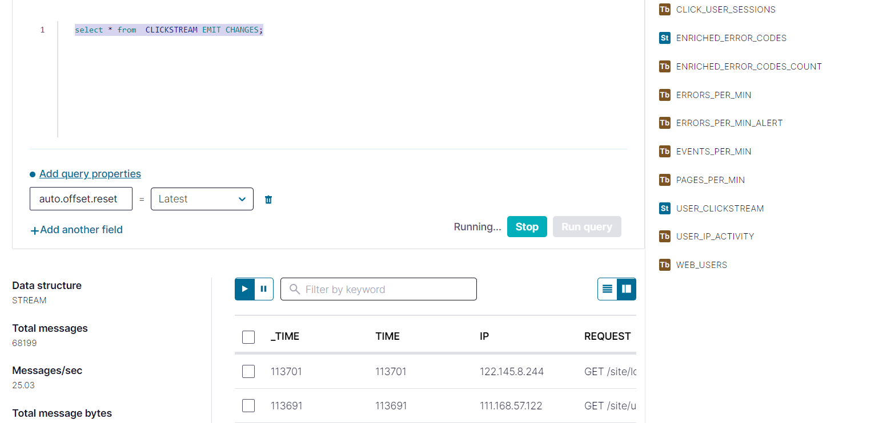
# Load the Clickstream Data in Grafana

Set up the required Elasticsearch document mapping template

```
docker-compose exec elasticsearch bash -c '/scripts/elastic-dynamic-template.sh'
```

Run this command to send the ksqlDB tables to Elasticsearch and Grafana:

```
docker-compose exec ksqldb-server bash -c '/scripts/ksql-tables-to-grafana.sh'
```

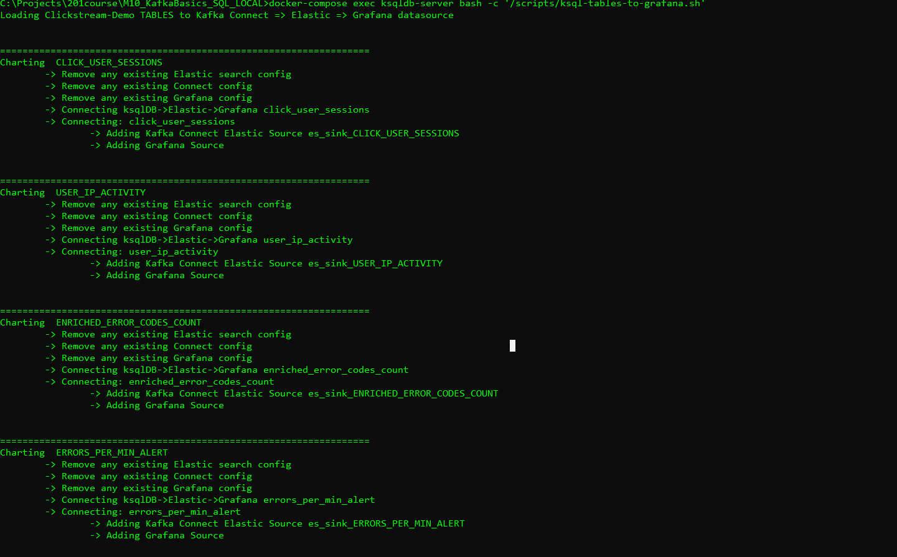

Load the dashboard into Grafana.

```
docker-compose exec grafana bash -c '/scripts/clickstream-analysis-dashboard.sh'
```

Navigate to the Grafana dashboard at http://localhost:3000. Enter the username and password as user and user. Then navigate to the Clickstream Analysis Dashboard.

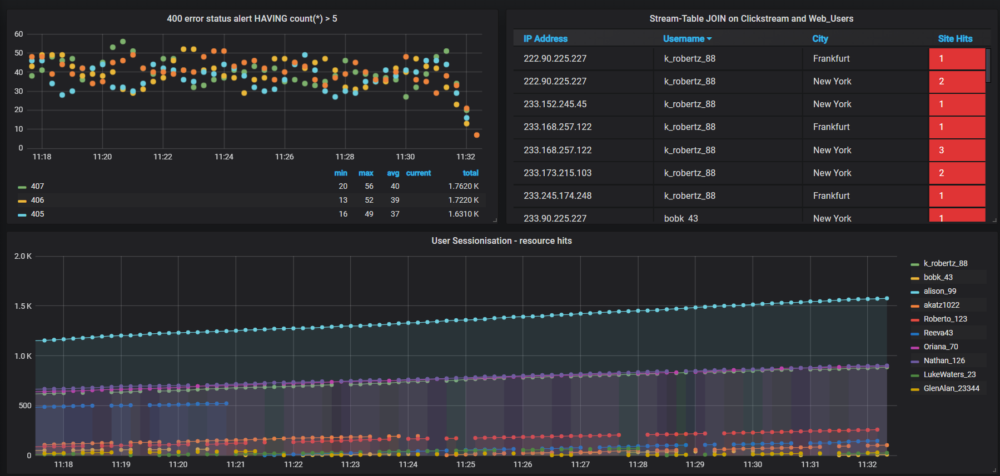

In the Confluent Control Center UI at http://localhost:9021, again view the running connectors. The three kafka-connect-datagen source connectors were created with the ksqlDB CLI, and the seven Elasticsearch sink connectors were created with the ksqlDB REST API.

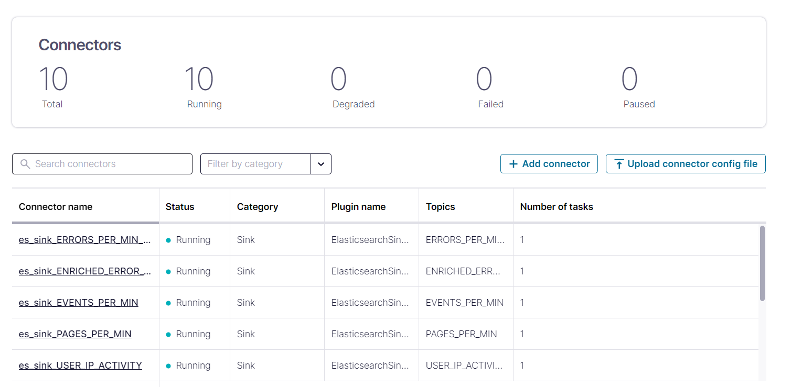

